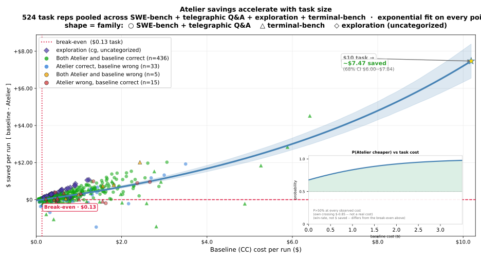

<!-- cspell:ignore Alamofire Excalidraw ast-grep codegraph ctags django jcodemunch nohit okhttp scip serena tokio vscode zoekt beasm Trendshift telegraphese -->

<div align="center">


# Atelier Runtime

### Honest and benchmark proven — a faster Agent: one-shot code search, **37.7% fewer turns**, **23.7% less wall-clock** (and average 30% cheaper)

Keep using Claude Code normally — Atelier sits underneath it and gives the agent better search, shorter file reads, compact command output, and reusable memory.

[](LICENSE)
[](https://github.com/atelier-ws/atelier/releases)
[](https://github.com/atelier-ws/atelier)

[](integrations/claude)
[](integrations/codex)
[](integrations/opencode)
[](integrations/copilot)
[](integrations/copilot-cli)
[](integrations/cursor)
[](scripts/install_hermes.sh)
[](integrations/antigravity)

**Live savings and time saved across Atelier sessions**

[](https://atelier.ws)
[](https://atelier.ws)
[](https://atelier.ws)
[](https://atelier.ws)

[Install](#install-in-30-seconds) · [Check your savings first](#check-your-own-savings) · [Why trust the numbers?](#why-trust-the-numbers) · [Results](#results) · [Pricing](https://atelier.ws/pricing)

[](https://atelier.ws/#terminal)

*Click for the full walkthrough on [atelier.ws](https://atelier.ws/#terminal).*

</div>

---

## Install in 30 seconds

Run this once:

```bash
curl -fsSL https://install.atelier.ws | bash
```

Then turn it on inside the project where you use Claude Code:

```bash
cd your-project
atelier init
```

Open Claude Code like you normally do. Atelier wires in better tools behind the scenes and starts tracking savings as sessions finish.

Already installed?

```bash
atelier update
```

Check that everything is connected:

```bash
atelier doctor
```

## What changes for you

Atelier does not ask you to learn a new coding app. It improves the work Claude Code already does:

| Before                                                       | With Atelier                                                                   |
| -------------------------------------------------------------- | -------------------------------------------------------------------------------- |
| Claude greps, reads a whole file, greps again to find code.  | One-shot code search returns the symbol, its callers, and exact ranges in a single call. |
| The same context gets rediscovered again and again.          | Useful session context can be reused, not re-searched.                         |
| Long grep-and-read loops burn turns and wall-clock time.     | Fewer round-trips: 37.7% fewer turns, 23.7% less wall-clock on SWE-bench Verified. |
| Speed and savings are hard to see.                           | A local meter shows turns, tokens, and cost dropping in real time.             |

### What actually gets replaced

`atelier init` gives Claude Code 5 tools and hides the built-ins behind them — one way to do each job, not two.

**Find things in one shot** -- no wandering the codebase call after call.

| Atelier tool  | Replaces (hidden from the model) | Why                                                                                                      |
| --------------- | ---------------------------------- | ---------------------------------------------------------------------------------------------------------- |
| `code_search` | Grep, Glob                       | One call returns the symbol, its callers/callees, and ranked source -- no grep-loop-then-read-whole-file. Ranked by call-graph centrality over a tree-sitter symbol table |
| `read`        | Read                             | Returns an outline or the exact`:L10-L40` range, budgeted, instead of the full file                      |
| `edit`        | Edit, Write                      | Verified, cross-file edits in one call instead of per-file patch-or-create guessing                      |
| `bash`        | Bash                             | Output is capped and structured so a noisy build log can't blow the context window                       |
| `web_fetch`   | WebFetch                         | Strips a page to clean Markdown instead of a raw HTML dump                                               |

What's unchanged: Claude Code itself, the model, your workflow. Full internals: [Architecture](docs/architecture.md).

### Why a runtime, not just tools

A bare MCP server is a library the model can call *if* it remembers to. A runtime decides what's callable at all — four jobs, four layers:

| Layer                           | Without it                                        | With it                                                                                |
| ------------------------------- | ------------------------------------------------- | -------------------------------------------------------------------------------------- |
| **Agents** — process isolation  | a "read-only" agent can still edit                | `explore`/`plan`/`research`/`review` hard-deny `edit`/`write` at the host-config level |
| **Skills** — standard library   | multi-step procedures re-improvised every session | encoded once, invoked the same way every time                                          |
| **Hooks** — interrupts          | wasteful re-reads; "done" without a check         | bad calls denied before they run; on Claude Code, session close blocked until verification ran (advisory on other hosts today) |
| **MCP tools** — syscall surface | agents fall back to grep-and-read under pressure  | natives hidden — Atelier tools are the only surface for those jobs                     |

### Agents

Packaged in [integrations/agents/](integrations/agents/) — each a distinct capability grant (subagent name `atelier:<mode>`), not a persona:

| Agent      | Writes? | Use                                              |
| ---------- | :-----: | ------------------------------------------------ |
| `code`     |   Yes   | default interactive — edits, refactors, features |
| `auto`     |   Yes   | fully autonomous — CI/headless runs              |
| `solve`    |   Yes   | end-to-end solving of a well-defined task        |
| `execute`  |   Yes   | one verified pass of an accepted plan            |
| `general`  |   Yes   | catch-all for mixed work                         |
| `bare`     |   Yes   | minimal toolset, same discipline                 |
| `explore`  |   No    | read-only exploration — locate and cite          |
| `plan`     |   No    | read-only planning, stops for human checkpoint   |
| `review`   |   No    | adversarial read-only review                     |
| `research` |   No    | external web research — cited memo               |

### Skills

Packaged in [integrations/skills/](integrations/skills/):

| Skill         | What it does                                                 |
| ------------- | ------------------------------------------------------------ |
| `atelier`     | manage Atelier itself via the CLI                            |
| `benchmark`   | measure savings on *your* repo — offline scan or live A/B    |
| `orchestrate` | one structured multi-step task, routed to the right surface  |
| `swarm`       | N parallel attempts in isolated worktrees — best result wins |
| `perf-review` | gate a change on measured performance, not read code         |
| `ux-review`   | gate shipped UI on objective checks in a real browser        |
| `recall`      | retrieve what past sessions learned                          |

## Check your own savings

Do not take our 30% claim on faith — scan your own local agent history before installing:

```bash
curl -fsSL https://savings.atelier.ws | bash
```

It reads local Claude/Codex session files, estimates where Atelier would have used fewer tokens or cheaper tool calls, and prints savings from your own history. Temporary local store — no account, no API keys.

Useful variants:

```bash
curl -fsSL https://savings.atelier.ws | bash -s -- --since 30d --top 10
curl -fsSL https://savings.atelier.ws | bash -s -- --host codex --limit 20
```

### Replay a past session

`atelier session replay` plays back a recorded session and, for each native call, **runs the real Atelier tool that would have replaced it** — grep/read loops collapse into one `code_search`, whole-file reads become budgeted outlines, `bash` logs get capped. It then estimates — from that session alone — the **cost, savings opportunity, and time** Atelier would have saved. No model re-run, nothing written; opens a shareable HTML page.

```bash
atelier session replay --last 1
```

Works on Claude Code, Codex, and opencode sessions. The saving is an estimate; the live re-measured A/B is `atelier benchmark local`.

## Why trust the numbers?

A live badge alone proves little — anyone can fake a counter. Four checks instead:

1. **Raw benchmark receipts:** headline numbers link to committed per-task runs, costs, and reproduction commands.
2. **Your own scan:** the savings command checks your machine, not our marketing page.
3. **Labeled live badges:** aggregate usage counters — never the source of the 30% claim.
4. **Rows where Atelier does not win:** Terminal-Bench 2.1 is flat on accuracy (-0.2pp); it stays in the table.

The trust is the audit trail, not the animation.

## Results

Measured on the same model, same tasks, and same environment:

| Benchmark                                           | Baseline correct | Atelier correct | Correct delta |        Baseline cost |        Atelier cost | Cost delta |
| ----------------------------------------------------- | -----------------: | ----------------: | --------------: | ---------------------: | --------------------: | -----------: |
| SWE-bench Verified, 50 tasks x 5 reps               |            80.8% |       **92.8%** |  **+12.0 pp** | $234.84 |**$165.45** |   **29.5% cheaper** |            |
| SWE-bench Lite, 10 tasks x 3 reps                   |            93.3% |        **100%** |   **+6.7 pp** |   $12.38 |**$10.79** |   **12.9% cheaper** |            |
| SWE-bench Pro, 10 tasks x 5 reps                    |            88.0% |       **90.0%** |   **+2.0 pp** |   $39.01 |**$30.61** |   **21.5% cheaper** |            |
| Exploration tasks across 7 large repos x 5 reps     |                - |               - |             - |    $19.11 |**$6.29** |     **67% cheaper** |            |
| Telegraphic Q&A, 20 prompts x 5 reps                |                - |               - |             - |     $8.93 |**$5.34** |   **40.2% cheaper** |            |
| Terminal-Bench 2.1, 89 tasks vs public leaderboard* |   78.9% expected |           78.7% |       -0.2 pp | $96.76 |**$69.52**† | **28.1% cheaper**† |            |

<sub>* Atelier 1 rep/task vs public leaderboard 5-rep average. † 5 timed-out tasks excluded from cost.</sub>

<p align="center">
  
</p>

SWE-bench Verified detail (250 runs a side) — one-shot search collapses the grep-and-read loop, so turns, wall-clock, and tool calls drop together:

| Metric               | Baseline | Atelier |            Delta |
| ---------------------- | ---------: | --------: | -----------------: |
| Turns                |    6,962 |   4,336 |  **37.7% fewer** |
| Wall-clock           |    14.3h |   10.9h | **23.7% faster** |
| Total tool calls     |    6,700 |   4,167 |       **-37.8%** |
| Output tokens        |    3.04M |   2.19M |  **27.9% fewer** |
| Bash                 |    3,327 |   1,785 |       **-46.3%** |
| Read                 |    1,733 |   1,050 |       **-39.4%** |
| Edit + Write         |    1,628 |     759 |       **-53.4%** |
| Search (code_search) |        - |     568 |     atelier-only |

Exploration detail (7 large repos × 5 reps, read-only Q&A, no edits):

| Tool                          | Baseline calls | Atelier calls |        Delta |
| ------------------------------- | ---------------: | --------------: | -------------: |
| Read                          |            672 |            23 |   **-96.6%** |
| Bash                          |            508 |            71 |   **-86.0%** |
| Search (code_search)          |              - |            23 | atelier-only |
| Agent + orchestration calls\* |             79 |             1 |   **-98.7%** |
| Total tool calls              |          1,259 |           118 |   **-90.6%** |
| input                         |        286,191 |       205,967 |   **-28.0%** |
| cache read                    |     35,862,919 |     2,753,393 |   **-92.3%** |
| cache write                   |      2,811,356 |       233,381 |   **-91.7%** |
| output                        |        426,367 |        68,893 |   **-83.8%** |
| input + cache write           |      3,097,547 |       439,348 |   **-85.8%** |

Source: [`exploration_2026_06_29`](benchmarks/codebench/results/exploration_2026_06_29/) · [`telegraphic_2026_07_08`](benchmarks/codebench/results/telegraphic_2026_07_08).

## One-shot code search vs 10 named tools

The search is the engine: right code in front of the agent on the first try. MRR and first-hit rate (rec@1) across ~7,200 query/gold pairs on 14 repos — 10 tools scored on the identical corpus. Atelier's rec@1 of 0.650 means the right code on the very first result two times in three, at 134ms p95:

| Provider                      |       MRR |     rec@1 |    p95 |
| ------------------------------- | ----------: | ----------: | -------: |
| **Atelier +semantic (BGE)**   | **0.727** | **0.650** |  390ms |
| Atelier lexical (default)     |     0.676 |     0.582 |  134ms |
| cocoindex-code (best rival)   |     0.557 |     0.457 |  595ms |
| serena                        |     0.401 |     0.359 | 3834ms |
| ripgrep                       |     0.376 |     0.320 |   66ms |
| universal-ctags (worst rival) |     0.237 |     0.226 |    1ms |

No one had scored these 10 tools against each other on a shared query set before -- each publishes its own number, on its own terms, against its own baseline.

## Why it works

Claude is strong; the loop around it is wasteful — grep, read a whole file, grep again. Atelier collapses that loop.

- **One-shot search:** symbol, callers, and exact ranges in a single call — the biggest source of the turn and wall-clock savings.
- **Better inputs:** exact file ranges, not whole files.
- **Better outputs:** compact command output and replies, exact technical facts intact.
- **Better memory:** context reused, not rediscovered.
- **Better guardrails:** hooks block risky edits, oversized reads, and unverified "done" states.
- **Discipline enforced:** think before coding, surgical changes — in every persona, not typed into a prompt once.

Same model, tighter loop: more tasks solved in fewer turns and less wall-clock time.

## What you get

- Works with Claude Code, Codex, Copilot, Copilot CLI, and opencode today; Cursor, Hermes Agent, and Antigravity integrations are in progress. Any MCP-compatible coding agent (LangChain, the OpenAI SDK, Gemini ADK, ...) can connect to the same tools.
- Runs locally by default.
- Open-core runtime: FSL-1.1-ALv2 engine, Apache-2.0 SDKs/integrations/docs.
- No account needed to start.
- Live local stats for cost, tokens, and savings.
- Optional paid features for heavy users and teams.

## Learn more

- [Installation](docs/installation.md)
- [Troubleshooting](docs/troubleshooting.md)
- [Benchmarks](BENCHMARKS.md) · [full results, backed by docs](docs/benchmarks/results.md) · [every "vs" comparison, with sources](https://atelier.ws/vs)
- [CLI reference](docs/cli.md)
- [Architecture](docs/architecture.md)

---

## Star History

<a href="https://www.star-history.com/?repos=atelier-ws%2Fatelier">
 <picture>
   <source media="(prefers-color-scheme: dark)" srcset="https://api.star-history.com/chart?repos=atelier-ws/atelier&type=date&theme=dark&legend=top-left&sealed_token=Rn2b6rT3ghX0sl1jSS4wFIX77UahxINbyd-AgVtDAgV7BVA7aIINml5rE7v5bjzY82nrlzsmEASna5oYdS-JdGPZryfB2SRqgi8jNQY8VQl0Ra6W8QEVE6Bwn2Kd9bQzeEp03p3upVa48_1mbFJUhLQRp5lbXS8sEsNeQ_DK7_DfIRefJbXyjB27dHQN" />
   <source media="(prefers-color-scheme: light)" srcset="https://api.star-history.com/chart?repos=atelier-ws/atelier&type=date&legend=top-left&sealed_token=Rn2b6rT3ghX0sl1jSS4wFIX77UahxINbyd-AgVtDAgV7BVA7aIINml5rE7v5bjzY82nrlzsmEASna5oYdS-JdGPZryfB2SRqgi8jNQY8VQl0Ra6W8QEVE6Bwn2Kd9bQzeEp03p3upVa48_1mbFJUhLQRp5lbXS8sEsNeQ_DK7_DfIRefJbXyjB27dHQN" />
   
 </picture>
</a>

---

## License

Open-core. The engine (`src/atelier/core`, `bench`, `infra`, `gateway` minus `gateway/sdk`, plus `tests/`, `benchmarks/`) is licensed under the [Functional Source License, v1.1, ALv2 Future License](LICENSE) (FSL-1.1-ALv2) — free for internal use, non-commercial research, and professional services
Converts to Apache-2.0 two years after each release. SDK bindings, host integrations, install scripts, and docs (`src/atelier/sdk/`, `src/atelier/gateway/sdk/`, `integrations/`, `scripts/`, `docs/`, `docs-site/`) are [Apache-2.0](LICENSE-APACHE).
