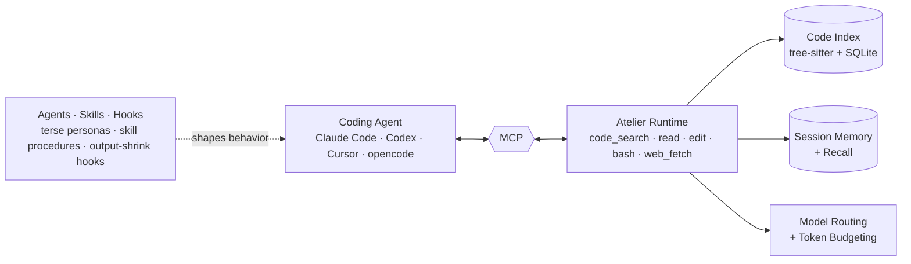

<!-- cspell:ignore Alamofire Excalidraw ast-grep codegraph ctags django jcodemunch nohit okhttp scip serena tokio vscode zoekt beasm -->

<div align="center">

# Atelier - The Runtime for Coding Agents

## Read smarter. Think sharper. Talk less. Never forget

[](LICENSE)
[](https://github.com/atelier-ws/atelier/releases)
[](https://github.com/atelier-ws/atelier)

[](#)
[](#)

[](https://claude.ai/code)
[](https://openai.com/codex)
[](https://opencode.ai)

**Live savings across all Atelier sessions** &nbsp;·&nbsp; updates on every session end

[](https://atelier.ws)
[](https://atelier.ws)
[](https://atelier.ws)

</div>

## The idea

Coding agents do not fail only because the model is weak. They fail because the runtime makes them read the wrong things, wander through vague workflows, flood the transcript, and rediscover context they already had.

Atelier gives coding agents a tighter loop:

- **Read smarter** — `code_search` replaces grep loops with relevant symbols, source, callers, callees, usages, and blast radius in one call. `read` returns outlines or exact ranges instead of dumping whole files.
- **Think sharper** — narrow modes and skills route work through the right shape: explore when the job is discovery, plan when the job needs sequencing, execute when the path is known, solve when it needs end-to-end iteration.
- **Talk less** — compact tool results, batched edits, terse personas, and `atelier -p` keep the transcript focused on decisions and final answers instead of narration.
- **Never forget** — recall, session memory, deduped reads, and mode-scoped context stop agents from paying again for context they already discovered.

The claim is simple: **less noise gives agents more room to land correct patches.**



_Full stack and subsystem breakdown: [docs/architecture.md](docs/architecture.md)._

### How it works

Every Atelier feature traces to one of four compression layers:

| Layer       | What it limits          | Example                                                                |
| ------------- | ------------------------- | ------------------------------------------------------------------------ |
| **Input**   | What the agent reads    | Indexed`code_search`, ranged `read`, compact `bash`, clean `web_fetch` |
| **Output**  | What the agent writes   | Terse personas, batched edits, subagent routing, skill procedures      |
| **Runtime** | What the agent can call | MCP tool replacement, hooks, swarm, workflows                          |
| **Context** | What the agent re-reads | Session recall, dedup responses, mode-scoped tools                     |

Detailed breakdown: [Core Tools](#core-tools), [Skills and Commands](#skills-and-commands), [What Changes After Init](#what-changes-after-init).

#### Telegraphic I/O

|                                                   | Baseline                                                                                                                                                                                                                                                                                                                                                                      | Atelier (telegraphic)                                                                                                                                                             |
| --------------------------------------------------- | ------------------------------------------------------------------------------------------------------------------------------------------------------------------------------------------------------------------------------------------------------------------------------------------------------------------------------------------------------------------------------- | ----------------------------------------------------------------------------------------------------------------------------------------------------------------------------------- |
| **Model writes** ("Why is the retry test flaky?") | "I looked into the failing test and it seems like the flakiness is caused by the retry logic using a real clock. The test sleeps for 100ms and then asserts that exactly three retries happened, but under CI load the timing can drift, which makes the assertion fail intermittently. I'd recommend injecting a fake clock so the test becomes deterministic."**71 tokens** | "Root cause: retry test uses a real clock — 100ms sleep + exact 3-retry assert drifts under CI load. Fix: inject a fake clock; test becomes deterministic."**38 tokens (−46%)** |

More: [docs/architecture.md](docs/architecture.md#telegraphic-instruction-surface)

## Honestly

I'm a solo founder working on [beseam.com](https://beseam.com). I was burning through my Claude Max credits in about four days. Every "token-saving" tool or prompt-engineered solution I found had the same problem: they only showed benchmarks on artificial tasks where they happened to excel. Nobody was measuring against the baseline on the same model, the same tasks, the same environment — just cherry-picked numbers.

I wanted a system that actually saves tokens across _every_ real coding task, not just the ones it was tuned for. So I built Atelier — a runtime that aggressively compresses what the agent reads, writes, and calls, and **benchmarks every feature against a real baseline so you can see exactly what works and what doesn't**.

The results are honest: [`+12pp resolved`](#results) on SWE-bench, [`29.5% cheaper`](#results) end-to-end, and every single raw run is published under `benchmarks/` for you to verify or reproduce.

## Results

Measured on the same model, same tasks, and same environment:

| Benchmark                                          |          Atelier result |                Baseline |            Delta |
| ---------------------------------------------------- | ------------------------: | ------------------------: | -----------------: |
| SWE-bench Verified, 50 sampled tasks x 5 reps      |      **92.8% resolved** |                   80.8% |     **+12.0 pp** |
| SWE-bench end-to-end cost                          |   **$165.45** | $234.84 |       **29.5% cheaper** |                  |
| SWE-bench turns                                    |               **4,336** |                   6,962 |  **37.7% fewer** |
| SWE-bench output tokens                            |               **2.19M** |                   3.04M |  **27.9% fewer** |
| SWE-bench wall-clock time                          |               **10.9h** |                   14.3h | **23.7% faster** |
| SWE-bench Lite, 10 tasks x 3 reps                  |     **100% resolved** |                   93.3% |      **+6.7 pp** |
| SWE-bench Lite cost                                |    **$10.79** | $12.38 |       **12.9% cheaper** |                  |
| SWE-bench Pro, 10 tasks x 5 reps                   |      **90.0% resolved** |                   88.0% |      **+2.0 pp** |
| SWE-bench Pro cost                                 |    **$30.61** | $39.01 |       **21.5% cheaper** |                  |
| Exploration tasks across 8 large repos             |     **$10.94** | $25.37 |         **57% cheaper** |                  |
| Terminal-Bench 2.1, 89 tasks vs public leaderboard* | 78.7% resolved | 78.9% expected | -0.2 pp |
| Terminal-Bench cost, 83/89 tasks w/ cost data*  | **$69.52** | $96.76 | **28.1% cheaper**† |

<sub>* Atelier: 1 rep/task. Baseline: public tbench.ai leaderboard, 5-rep average per task. † Other 5 tasks in Atelier timeout and can't capture cost, not zero-cost runs; see BENCHMARKS.md.</sub>

<p align="center">
  
</p>

Benchmarks are not hand-waved: raw runs, per-task outcomes, costs, turn counts, setup notes, and reproduction commands live in [BENCHMARKS.md](BENCHMARKS.md) and under [`benchmarks/codebench/results/`](benchmarks/codebench/results/).

## Estimate Your Savings

Before installing Atelier into a repo, you can scan your local coding-agent session history and estimate the potential savings from routable tool calls.

```bash
curl -fsSL https://savings.atelier.ws | bash
```

The script downloads the latest Atelier release into a cached temporary venv, then runs:

```bash
atelier session stats --source live --since 7d --top 5
```

It is read-only, uses a temporary store, does not require Atelier login or provider API keys, and prints aggregate cost, tool-call, realized-savings, and potential-savings numbers from local host session files.

Useful variants:

```bash
curl -fsSL https://savings.atelier.ws | bash -s -- --since 30d --top 10
curl -fsSL https://savings.atelier.ws | bash -s -- --host codex --limit 20
```

## Quick Start

Install Atelier, then initialize it inside any repo where you use an AI coding agent.

```bash
curl -fsSL https://install.atelier.ws | bash

cd your-project
atelier init
```

Already installed?

```bash
atelier update
```

Check your setup:

```bash
atelier doctor
```

Run a direct prompt when you want a compact terminal answer without opening an interactive agent:

```bash
# Direct `atelier -p` uses owned HTTP model execution, so it needs an API-style credential:
export ANTHROPIC_API_KEY=sk-ant-...
# or OPENAI_API_KEY / GOOGLE_API_KEY / AWS_PROFILE / AZURE_API_KEY / another LiteLLM-compatible key

atelier -p "summarize this repo"
cat test.log | atelier -p "debug this failure"

# Batch quick prompts into one Atelier run:
atelier -p "summarize this repo" -p "list the riskiest files" -p "suggest the next test"

# Claude subscription/OAuth auth belongs to Claude Code itself. Use it through host/runner flows,
# for example a Claude-backed swarm runner, not direct `atelier -p`.
```

Why use native `atelier -p`:

- **One-shot answers** — it prints only the final answer, so shell scripts and CI jobs do not need to scrape an interactive transcript.
- **Batch prompts** — repeated `-p` flags are folded into one ordered run, which is cheaper than launching a separate agent session for each small question.
- **Smart routing** — when you do not pin a model, Atelier routes through your configured LiteLLM-compatible providers and falls back when a provider is blocked.
- **Cache-aware prompts** — the owned runtime keeps a stable system/tool prefix, uses Anthropic ephemeral cache breakpoints when available, and preserves provider automatic prefix caching where supported.
- **Same tools, less ceremony** — the prompt can still use Atelier's code/search/read/bash tool loop, but you get a terminal-sized answer instead of opening a full host agent UI.

After `atelier init`, start your normal coding agent. Atelier wires itself into supported host MCP config so the agent sees Atelier's grounded tools instead of falling back to raw file and shell primitives.

## What Changes After Init

Atelier is not only a prompt that tells an agent to be brief. It shrinks the tool surface, the command output, and the final replies that get fed back into the model.

Atelier adds four runtime layers around your coding agent:

| Layer     | What it changes                                                                                                                                                                                                                                                                                                                     |
| ----------- | ------------------------------------------------------------------------------------------------------------------------------------------------------------------------------------------------------------------------------------------------------------------------------------------------------------------------------------- |
| MCP tools | Replaces broad native file/search/shell operations with`code_search`, `read`, `edit`, `bash`, and `web_fetch`.                                                                                                                                                                                                                      |
| Agents    | Gives common work modes explicit boundaries:`code`, `explore`, `plan`, `execute`, `solve`, `review`, `research`, and more.                                                                                                                                                                                                          |
| Skills    | Packages repeatable procedures such as benchmarking, orchestration, performance review, recall, swarm, and UX review.                                                                                                                                                                                                               |
| Hooks     | Intercepts tool calls and session endings to block wasteful reads, risky edits, and unverified "done" states. Also shadow-shrinks oversized results from the host's builtin Bash and any other MCP server: the full output spills to a recoverable file and one canonical notice names the way back — no config or routing change. |

The important difference is enforcement. A prompt can ask an agent to be disciplined; a runtime controls what the agent can call and when.

## Core Tools

| Tool          | Use                                                                                                                                                        |
| --------------- | ------------------------------------------------------------------------------------------------------------------------------------------------------------ |
| `code_search` | Finds relevant symbols, source, callers, callees, usages, and blast radius in one call.                                                                    |
| `read`        | Reads files by outline, exact range, full expansion, or`:summary` — a bounded type-aware gist (heuristic, upgraded by a local LLM when one is reachable). |
| `edit`        | Applies deterministic single-file or multi-file edits in one verified call.                                                                                |
| `bash`        | Runs commands with compact, structured output so test logs do not flood context.                                                                           |
| `web_fetch`   | Fetches public URLs as clean Markdown — optionally as a bounded summary — when web research is allowed.                                                  |

## Skills And Commands

Most Atelier capabilities have two surfaces:

- **Skill path:** ask your agent in natural language; the skill gathers missing parameters and chooses the right runtime surface.
- **CLI/runtime path:** use exact commands for CI, scripts, docs, reproducible launches, or when you already know the flags.

| Capability         | Skill path                                 | CLI/runtime path                                  | Use it for                                                                                        |
| -------------------- | -------------------------------------------- | --------------------------------------------------- | --------------------------------------------------------------------------------------------------- |
| Benchmark          | `/benchmark "compare this repo"`           | `atelier benchmark local --repo . --prompt "..."` | Measure Atelier vs vanilla on your own repo with an up-front cost estimate.                       |
| Orchestrate        | `/orchestrate "ship this multi-step task"` | `workflow` MCP tool                               | Route one structured task to direct subagent, isolated/background execution, or durable workflow. |
| Performance review | `/perf-review "check this change"`         | skill-driven checks                               | Verify latency, memory, I/O, and scaling with real measurements.                                  |
| Recall             | `/recall "what did we learn about auth?"`  | `atelier session recall ...`                      | Retrieve useful context and lessons from past Atelier sessions.                                   |
| Swarm              | `/swarm "try 3 fixes and keep the best"`   | `atelier swarm start ...`                         | Run multiple isolated attempts in git worktrees, validate, reduce, inspect, and apply.            |
| UX review          | `/ux-review "review this shipped UI"`      | skill-driven browser checks                       | Check accessibility, responsive behavior, interaction states, and visual regressions.             |

Packaged skills live in [`integrations/skills/`](integrations/skills/). The CLI remains the stable automation layer underneath skills; skills are the agent-friendly way to invoke it.

## Local UI And Observability

Atelier is more than a search MCP. The optional local stack runs both the service API and the web frontend, so you can inspect runs, token use, costs, savings, and runtime state outside the chat transcript.

```bash
atelier stack start
atelier dashboard open
atelier stack status
```

For terminal-only workflows:

```bash
atelier dashboard
atelier savings --json
```

## Swarm

Use the **`/swarm` skill** when you want the agent to choose the right swarm shape from a natural-language goal. It asks for the missing parameters, maps the job to the right reducer, launches the existing swarm runtime, and gives you the `run_id` plus status/log/apply commands.

```text
/swarm "try three independent fixes for the flaky checkout test and keep the best validated patch"
/swarm "optimize bundle size; measure with npm run build; do not regress tests"
/swarm "audit auth for bypasses with five read-only attempts and union the findings"
```

Use the **CLI** when you need an explicit, reproducible launch: CI, scripts, benchmark runs, exact runner/model flags, or when you already know the spec and validation commands.

```bash
atelier swarm start program.md --runs 3 --continuous \
  --runner codex \
  --runner-model <model> \
  --validate "make test"

atelier swarm list
atelier swarm logs <run_id> --child-id wave-01-run-01
atelier swarm apply <run_id>
```

Each child gets its own git worktree, isolated `ATELIER_ROOT`, copied task spec, live logs, structured result artifact, and validation commands. Accepted patches can be exported or applied back to your repo.

Reducers let you choose how candidates are combined: `merge` for normal solving, `best` for optimization, `union` for search/audit work, and `vote` for verification.

## Workflows

Atelier's workflow runtime is the durable path for structured multi-step work. It stores a workspace-local run state, tracks step progress, and supports `run`, `status`, `inspect`, `resume`, `pause`, and `stop` through the `workflow` MCP tool.

The `orchestrate` skill chooses the narrowest execution surface for a request: direct subagent, isolated/background task, or durable workflow. Use it when a task needs a plan, checkpoints, resumability, or approval gates.

```text
/orchestrate "plan and execute the auth migration with a review checkpoint"
```

You do not need any of this on day one. Install Atelier, run your normal coding agent, and let the runtime improve the tool loop underneath it. The advanced surfaces are there when the work gets bigger than one prompt.

## Benchmarks

Start with the summary above. Go deeper here:

- [BENCHMARKS.md](BENCHMARKS.md) - headline results, methodology, and reproduction commands.
- [`benchmarks/codebench/results/swe50_2026_06_30/`](benchmarks/codebench/results/swe50_2026_06_30/) - SWE-bench raw results.
- [`benchmarks/codebench/results/swe-pro_2026_07_07/`](benchmarks/codebench/results/swe-pro_2026_07_07/) - SWE-bench Pro raw results.
- [`benchmarks/codebench/results/exploration_2026_06_29/`](benchmarks/codebench/results/exploration_2026_06_29/) - exploration benchmark raw results.
- [`benchmarks/codebench/results/retrieval_2026_07_05/`](benchmarks/codebench/results/retrieval_2026_07_05/) - retrieval evaluation raw results.
- [`benchmarks/harbor/results/atelier/2026-07-07__02-24-29/`](benchmarks/harbor/results/atelier/2026-07-07__02-24-29/) - Terminal-Bench run data.

## Docs

- [Installation](docs/installation.md)
- [CLI reference](docs/cli.md)
- [Host setup for agent CLIs](docs/hosts/all-agent-clis.md)
- [MCP SDK](docs/sdk/mcp.md)
- [Troubleshooting](docs/troubleshooting.md)
- [Architecture: Technology & Concepts](docs/architecture.md)

## License

Apache 2.0 — see [`LICENSE`](LICENSE) for the full text.
