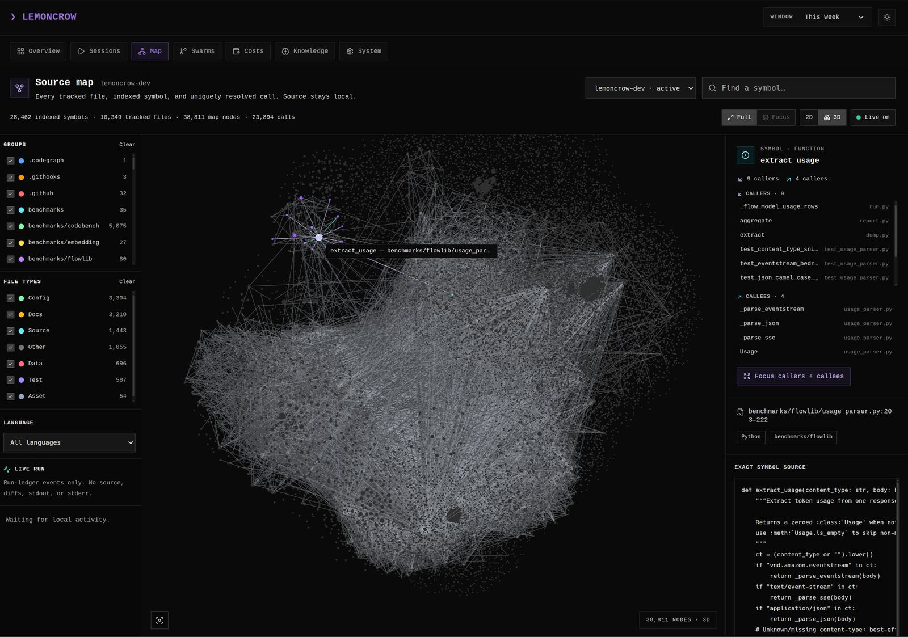

<!-- cspell:ignore Alamofire Excalidraw ast-grep codegraph ctags django jcodemunch nohit okhttp scip serena tokio vscode zoekt beasm Trendshift telegraphese -->

<div align="center">


# LemonCrow Runtime

### Keep your coding agent sharp on real codebases

**Context engineering, done right.**

LemonCrow runs underneath Claude Code, Codex, and other supported hosts with a local code graph, exact-range reads, bounded output, durable memory, and verified runtime controls — fully local, no account required.

**State-of-the-art context engineering.** LemonCrow is tuned end to end across input context and output — ranked retrieval, exact-range reads, and bounded, compacted output — and out-measures grep-class code-index and output-compression tooling on the [numbers below](#results) (~1.9x retrieval MRR vs ripgrep, 27.9% fewer output tokens on SWE-bench Verified).

[](LICENSE)
[](https://github.com/lemoncrow-lab/lemoncrow/releases)
[](https://github.com/lemoncrow-lab/lemoncrow)

[](integrations/claude)
[](integrations/codex)
[](integrations/opencode)
[](integrations/copilot)
[](integrations/copilot-cli)

[Quick start](#quick-start) · [What it does](#what-lemoncrow-does) · [Limitations](#what-lemoncrow-does-not-do) · [Privacy](#privacy-and-network-behavior) · [Results](#results) · [Removal](#removal)

</div>

---

## Why I built this

I kept burning my weekly credits before the week was out. Every
"token-saving" tool I tried claimed wins but none measured what I actually
paid — real dollars, end to end, on real tasks. Token counts aren't a bill.

So I built LemonCrow: a runtime that lives *inside* your existing agent
host, changes nothing about your workflow, and squeezes out the maximum
saving it can. Every number below is an absolute-dollar measurement
([BENCHMARKS.md](BENCHMARKS.md)) — not a token-count hand-wave.


## Quick start

Install from a checksummed GitHub release:

    curl -fsSL https://github.com/lemoncrow-lab/lemoncrow/releases/latest/download/install.sh | bash

… or build from source (see [Installation](docs/installation.md)):

    git clone https://github.com/lemoncrow-lab/lemoncrow
    cd lemoncrow
    bash scripts/local.sh

Then initialize it inside the project where you use your coding agent — no login,
no network:

    cd your-project
    lc init
    lc status

`lc init` wires better tools into your agent host and registers the repository
locally. `lc status` reports local runtime health. That's it — you're running.

## What LemonCrow does

LemonCrow keeps your existing coding agent and changes the working set around it:

<p align="center">
  
</p>
<p align="center"><sub>Your codebase's code universe — 28,462 symbols · 38,811 nodes · 23,894 calls. Live, local, on this repo.</sub></p>

| Stage      | Runtime behavior                                                                                                     |
| ---------- | ------------------------------------------------------------------------------------------------------------------- |
| **Find**   | Rank symbols, definitions, callers, callees, usages, and exact source ranges before broad file exploration.        |
| **Read**   | Return an outline or only the requested lines; cap noisy command and web output with recoverable spill files.      |
| **Carry**  | Preserve useful task state through memory, deduplication, compaction manifests, and handover packets.              |
| **Verify** | Notice code changes without tests or checks, then nudge the agent before it declares completion.                   |

### What actually gets replaced

On Claude Code, `lc init` gives the agent five grounded tools and hides the
equivalent built-ins — one way to do each job, not two. Other hosts use the
strongest equivalent controls they expose.

| LemonCrow tool | Replaces (hidden from the model) | Why |
| -------------- | -------------------------------- | --- |
| `code_search`  | Grep, Glob   | One call returns the symbol, its callers/callees, and ranked source — no grep-loop-then-read-whole-file. Ranked by call-graph centrality over a tree-sitter symbol table |
| `read`         | Read         | Returns an outline or the exact `:L10-L40` range, budgeted, instead of the full file |
| `edit`         | Edit, Write  | Verified, cross-file edits in one call instead of per-file patch-or-create guessing |
| `bash`         | Bash         | Output is capped and structured so a noisy build log can't blow the context window |
| `web_fetch`    | WebFetch     | Strips a page to clean Markdown instead of a raw HTML dump |

What's unchanged: the host, the model, your workflow. Full internals:
[Architecture](docs/architecture.md).

### Agents

Packaged in [integrations/agents/](integrations/agents/) — each a distinct
capability grant (subagent name `lemoncrow:<mode>`):

| Agent | Writes? | Use |
| ----- | :-----: | --- |
| `code`     | Yes | default interactive — edits, refactors, features |
| `auto`     | Yes | fully autonomous — CI/headless runs |
| `solve`    | Yes | end-to-end solving of a well-defined task |
| `execute`  | Yes | one verified pass of an accepted plan |
| `general`  | Yes | catch-all for mixed work |
| `bare`     | Yes | minimal toolset, same discipline |
| `explore`  | No  | read-only exploration — locate and cite |
| `plan`     | No  | read-only planning, stops for human checkpoint |
| `review`   | No  | adversarial read-only review |
| `research` | No  | external web research — cited memo |

### Skills

Optional Packaged in [integrations/skills/](integrations/skills/): `/lemoncrow`, `/benchmark`,
`/orchestrate`, `/swarm`, `/perf-review`, `/ux-review`, `/recall`.

### Inspect your own sessions

```bash
lc session stats     # read-only report of wasted tool calls and round-trips
lc session replay    # replay a recorded session through the real LemonCrow tools
```

Both are local and read-only — no model re-run, nothing transmitted.

## What LemonCrow does not do

- It is **not** a hosted service. There is no cloud backend, dashboard account,
  or team collaboration server.
- It does **not** run your model for you — you bring and configure your own
  provider/API key (Anthropic, OpenAI, Ollama, …).
- It does **not** guarantee the benchmark deltas below on your repository;
  results vary by task, codebase, and model.
- Some integrations are early or in progress; behavior varies by host (e.g.
  session-close verification is enforced on Claude Code, advisory elsewhere).

## Privacy and network behavior

- **Runs locally.** After install, all core functionality works offline and
  contacts **no** LemonCrow-controlled server.
- **Telemetry is OFF by default** and strictly opt-in. A global `DO_NOT_TRACK=1` / `LEMONCROW_TELEMETRY=off`
  environment kill switch is honored.
- **No** identifier, repository path, source code, or
  symbol name leaves your machine. There is no crash reporting.
- The only network calls the runtime makes are ones you initiate (`lc update`,
  which checks GitHub Releases).
- Full detail: [docs/privacy.md](docs/privacy.md).

## Supported environments

- **Operating systems:** Linux and macOS (primary); Windows is partially, never tested.
- **Runtime:** Python 3.12–3.13, managed with [`uv`](https://docs.astral.sh/uv/).
- **Agent hosts:** Claude Code, Codex and opencode today;
  Copilot, Cursor, Hermes, and Antigravity are in progress. Any MCP-compatible agent can
  connect to the same tools.
- **Build requirements:** `uv`, a C toolchain (only if you opt into the `mypyc`
  performance build; a pure-Python build works without it), and `git`.
- **Known limitations:** see [What LemonCrow does not do](#what-lemoncrow-does-not-do)
  and [Troubleshooting](docs/troubleshooting.md).

## Results

These are fixed results from pinned benchmark runs — not a live counter. Every
headline number links back to committed raw runs and methodology in
[BENCHMARKS.md](BENCHMARKS.md). The model, tasks, containers, turn limits, and
verification harness were held constant. Results are mixed by design and include
a regression (SWE-bench Lite below).

| Benchmark | Baseline correct | LemonCrow correct | Correct delta | Baseline cost | LemonCrow cost | Cost delta |
| --- | ---: | ---: | ---: | ---: | ---: | ---: |
| SWE-bench Verified, 50 tasks x 5 reps | 80.8% | **92.8%** | **+12.0 pp** | $234.84 | **$165.45** | **29.5% cheaper** |
| SWE-bench Lite, 10 tasks x 5 reps | 98.0% | 96.0% | -2.0 pp | $19.83 | **$17.51** | **11.7% cheaper** |
| SWE-bench Pro, 10 tasks x 5 reps | 88.0% | **90.0%** | **+2.0 pp** | $39.01 | **$30.61** | **21.5% cheaper** |
| Exploration tasks across 7 large repos x 5 reps | - | - | - | $19.11 | **$6.29** | **67% cheaper** |
| Telegraphic Q&A, 20 prompts x 5 reps | - | - | - | $8.40 | **$4.48** | **46.7% cheaper** |
| Terminal-Bench 2.1, 89 tasks x 5 reps (matched)\* | 78.9% | **80.0%** | **+1.1 pp** | — | — | — |

<sub>\* Both arms 89 tasks x 5 reps = 445 trials on the same dataset (LemonCrow's Harbor run vs the Claude Code 2.1.205 leaderboard run), so correctness is directly comparable. LemonCrow also sends 91.8% fewer fresh input tokens (1.05M vs 12.87M); cost is not a matched comparison here — see [BENCHMARKS.md](BENCHMARKS.md#terminal-bench).</sub>

<p align="center">
  
</p>

SWE-bench Verified detail (250 runs a side) — one-shot search collapses the
grep-and-read loop, so turns, wall-clock, and tool calls drop together:

| Metric | Baseline | LemonCrow | Delta |
| --- | ---: | ---: | ---: |
| Turns | 6,962 | 4,336 | **37.7% fewer** |
| Wall-clock | 14.3h | 10.9h | **23.7% faster** |
| Total tool calls | 6,700 | 4,167 | **-37.8%** |
| Output tokens | 3.04M | 2.19M | **27.9% fewer** |

### Scale

Indexing throughput and search quality hold up at repository sizes agents
actually hit. A cold full rebuild of the Linux kernel core (1.24M symbols,
4.5M lines) and retrieval quality vs grep-class tools on ~7,200 query/answer
pairs across 14 repos:

| Metric | LemonCrow | Grep-class baseline |
| --- | ---: | ---: |
| Linux cold index, lexical (1.24M symbols) | **179s** (~3 min) | — |
| Linux cold index, zoekt trigram | **13.7s** | — |
| Retrieval MRR (higher = better) | **0.727** semantic / 0.676 lexical | 0.376 (ripgrep) |
| Query latency, p95 | 134ms lexical / 390ms semantic | **66ms** (ripgrep) |

Ranked search is ~1.9x more accurate than ripgrep at a still-interactive p95;
ripgrep wins raw latency but not what it finds. Per-repo indexing table and the
full 13-tool retrieval comparison: [BENCHMARKS.md](BENCHMARKS.md#indexing-time).

Reproduce any of this from committed raw data: see [BENCHMARKS.md](BENCHMARKS.md)
and [docs/benchmarks/results.md](docs/benchmarks/results.md).

## Learn more

- [Installation](docs/installation.md)
- [Troubleshooting](docs/troubleshooting.md)
- [Benchmarks](BENCHMARKS.md) · [full results with methodology](docs/benchmarks/results.md)
- [CLI reference](docs/cli.md)
- [Architecture](docs/architecture.md)
- [Privacy & network behavior](docs/privacy.md)
- [Maintenance-mode transition (audit & rationale)](docs/maintenance-mode-transition.md)

## Removal

Uninstall LemonCrow and its host integrations, preserving your data by default:

```bash
bash scripts/uninstall.sh
```

To also remove all LemonCrow-managed local state (databases, caches, logs, the
local installation identifier, and configuration):

```bash
bash scripts/uninstall.sh --purge
```

The uninstaller stops background services, removes user-level systemd/launchd
units, removes LemonCrow-owned host-integration entries (without touching
unrelated agent-host configuration), reverts LemonCrow's PATH changes, and prints
exactly what was removed and preserved. Preview with `--dry-run`.

---

## License

LemonCrow is free and open-source software under the
[Apache License, Version 2.0](LICENSE) — in its entirety, including the
`lemoncrow.pro` engine. See [LICENSE](LICENSE) and [NOTICE](NOTICE).
