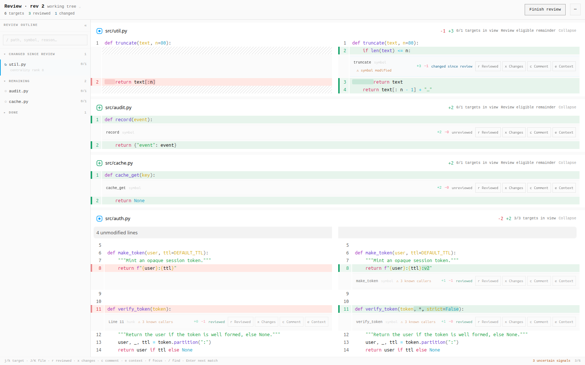
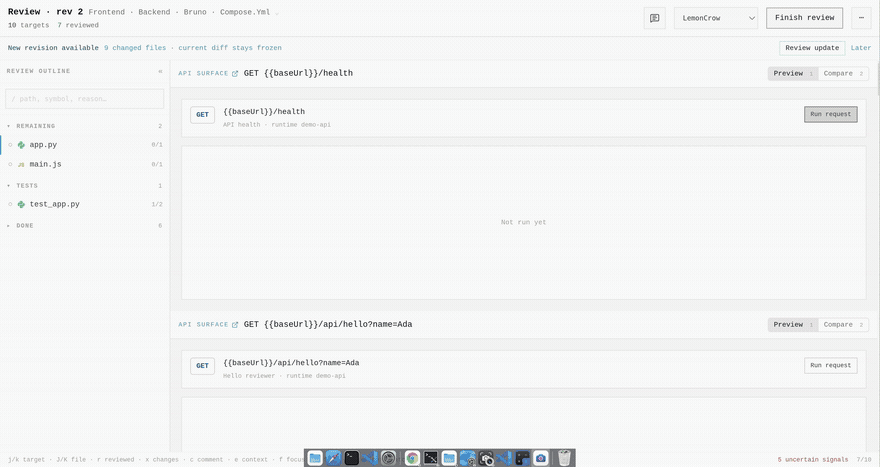
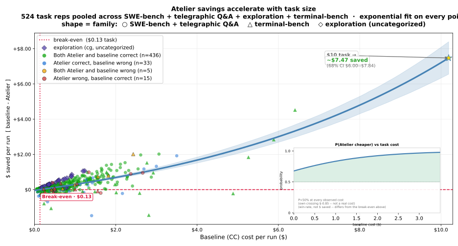
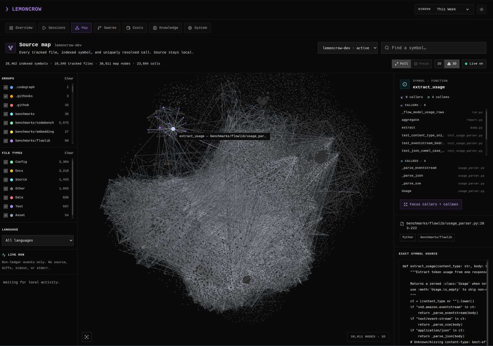

<!-- cspell:ignore Alamofire Excalidraw ast-grep codegraph ctags django jcodemunch nohit okhttp scip serena tokio vscode zoekt beasm Trendshift telegraphese -->

<div align="center">


# LemonCrow Runtime

### Understand what your coding agents changed

Review agent-written code with impact, provenance, verification evidence, and
review state that survives revisions.

**~30% lower cost · ~25% faster · without sacrificing task quality**

LemonCrow is a local review workspace backed by code intelligence, exact-range
reads, bounded tool output, memory, routing, and verification across supported
coding-agent hosts.



<sub>Real Review Reader · revision 2 · reviewed work preserved while changed and new work returns to the queue.</sub>

[](LICENSE)
[](https://github.com/lemoncrow-lab/lemoncrow/releases)
[](https://github.com/lemoncrow-lab/lemoncrow)

[Install](#install) · [Review](#review-agent-changes) · [Results](#results) · [How it works](#how-it-works) · [Other capabilities](#other-capabilities) · [Privacy](#privacy) · [Reference](#reference)

</div>

---

<a id="install" name="install"></a>
<a id="quick-start" name="quick-start"></a>

## Install

Hosted install (thin client + host integrations, no local LemonCrow server):

```bash
curl -fsSL https://github.com/lemoncrow-lab/lemoncrow/releases/latest/download/hosted.sh \
  | LEMONCROW_HOSTED_URL=https://your-lemoncrow-server bash
```

For a local-server production install from this repository, use `make prod`. It
builds the loopback server into the bundle, starts it on `127.0.0.1:7420` with a
machine credential, and points the same thin client at that local endpoint.
`make hosted HOSTED_URL=...` exercises the hosted production path from a
checkout. Hosted authentication is owned by Authward; `lc auth login` performs
the device flow directly against the Authward issuer advertised by the server.

The loopback server is a device-local surface, not a remote deployment target.
Do not place a reverse proxy, Cloudflare Tunnel, SSH port-forward, ngrok, or a
similar tunnel in front of port `7420` to expose Review remotely. Detectable
proxy/forwarding context is refused for local browser trust, but a raw TCP
forward can be indistinguishable from genuine loopback traffic. For remote
Review, use the hosted server path and Authward authentication.

Install once, then open your coding agent in a repository. The LemonCrow
SessionStart hook opens the workspace view and syncs only the content the server
needs; there is no per-repository local index bootstrap.

Anonymous aggregate telemetry is enabled by default and can be disabled; see
[Privacy](#privacy).

---

<a id="review-agent-changes" name="review-agent-changes"></a>

## Review agent changes

Coding agents can produce changes faster than a human can confidently review
them. LemonCrow treats human review state as the durable object instead of
asking a model to write another review summary.

Start with the local review reader:

```bash
lc review --open    # local browser review reader
lc review           # terminal review summary
lc review --staged  # exactly what you are about to commit
```

<p align="center">
  
</p>
<p align="center"><sub>Real <code>lc review --open</code> demo · diff → rendered UI preview → compare → review context.</sub></p>

The review workflow is designed to answer:

- what changed and where should I start?
- which changed definitions affect code outside the diff?
- which session or authoring evidence is associated with the change?
- which tests or checks actually ran?
- what have I already reviewed?
- after the author changes the code, which of my prior judgments are still valid?
- which comments still need action?

LemonCrow does not turn those signals into `AI APPROVED` or `SAFE TO MERGE`.
Human judgment remains final.

### Review only what changed again

Review marks are attached to content rather than line numbers. If an agent adds
lines above something you already reviewed, that work stays reviewed. If the
reviewed content changes, LemonCrow puts it back in front of you.

```bash
lc review --mark src/auth.py
lc review --comment "ttl is hardcoded" --on src/auth.py:L81
# author or agent revises the change
lc review --since-my-review
lc review --feedback
```

Comments are re-anchored only when the new location is unambiguous. Otherwise
they are reported as orphaned instead of being silently moved.

`lc review` also exposes impact outside the patch, review ordering, provenance,
and recorded verification evidence. Missing evidence is reported as unknown;
LemonCrow does not synthesize a passing test status.

See the [10-minute review walkthrough](docs/reference/review-walkthrough.md) or
the [CLI reference](docs/reference/cli.md#reviewing-agent-written-changes).
<a id="results" name="results"></a>

## Results

The review workflow runs on the same code-intelligence runtime used by coding
agents. The numbers below measure the runtime on complete tasks. They are fixed
results from pinned benchmark runs, not live counters. Full methodology and
raw-run references are in [BENCHMARKS.md](BENCHMARKS.md).

**~30% lower cost · ~25% faster · without sacrificing task quality**

<sub>SWE-bench Verified, same model and harness: 29.5% lower cost, 23.7% less wall-clock time, and 92.8% resolved vs 80.8% baseline.</sub>

| Benchmark | Baseline correct | LemonCrow correct | Baseline cost | LemonCrow cost | Cost delta |
<sub>SWE-bench Verified, same model and harness: 29.5% lower cost, 23.7% less wall-clock time, and 92.8% resolved vs 80.8% baseline.</sub>
| Benchmark | Baseline correct | LemonCrow correct | Baseline cost | LemonCrow cost | Cost delta |
| --- | ---: | ---: | ---: | ---: | ---: |
| SWE-bench Verified, 50 tasks × 5 reps | 80.8% | **92.8%** | $234.84 | **$165.45** | **29.5% cheaper** |
| SWE-bench Lite, 10 tasks × 5 reps | **98.0%** | 96.0% | $19.83 | **$17.51** | **11.7% cheaper** |
| SWE-bench Pro, 10 tasks × 5 reps | 88.0% | **90.0%** | $39.01 | **$30.61** | **21.5% cheaper** |
| Terminal-Bench 2.1, 89 tasks × 5 reps, Opus 4.8 | 78.9% | 78.9% | $73.75 | **$61.98** | **16.0% cheaper** |

The table includes the SWE-bench Lite regression: LemonCrow was cheaper on that
run but scored 2 percentage points lower. The benchmark set is not filtered to
keep only favorable results.

On SWE-bench Verified, the same pinned run used **37.7% fewer turns**, **23.7%
less wall-clock time**, **37.8% fewer tool calls**, and **27.9% fewer output
tokens**.

<p align="center">
  
</p>

For retrieval and scale, the benchmark suite also includes ~7,200 query/answer
pairs across 14 repositories. LemonCrow measured 0.727 semantic retrieval MRR
versus 0.376 for ripgrep, with a 390 ms semantic-search p95. A cold lexical
index of Linux kernel core (1.24M symbols, 4.5M lines) measured 179 seconds.
See [indexing and retrieval results](BENCHMARKS.md#indexing-time) for the full
comparison and caveats.

---

<a id="how-it-works" name="how-it-works"></a>
<a id="what-lemoncrow-does" name="what-lemoncrow-does"></a>

## How it works

LemonCrow keeps your existing coding agent and changes the working set around
it. The runtime is local and operates across four stages:

| Stage | What LemonCrow does |
| --- | --- |
| **Find** | Rank symbols, definitions, callers, callees, usages, and exact source ranges before broad file exploration. |
| **Read** | Return an outline or requested ranges; cap noisy command and web output with recoverable spill files. |
| **Carry** | Preserve useful task state through memory, deduplication, compaction manifests, and handover packets. |
| **Verify** | Record verification evidence and notice code changes that have no corresponding checks. |

<p align="center">
  
</p>
<p align="center"><sub>LemonGraph — the local code graph used for search, impact, and review context.</sub></p>

On Claude Code, `lc init` can replace equivalent built-in exploration tools with
LemonCrow's grounded tools. Other hosts use the strongest controls they expose;
capability depth varies by host.

| LemonCrow tool | Purpose |
| --- | --- |
| `code_search` | Ranked code search with definitions, callers/callees, usages, and source ranges. |
| `read` | Outlines or exact ranges instead of full-file reads by default. |
| `edit` | Verified multi-file edits. |
| `bash` | Bounded structured command output with recoverable spill files. |
| `web_fetch` | Clean page extraction instead of raw HTML. |

The point is not to optimize one isolated retrieval call. A coding task is a
loop: find → read → act → carry → verify. LemonCrow measures the completed task
because saving tokens in one step is not useful if the agent buys them back in
extra turns later.

Architecture details: [docs/reference/architecture.md](docs/reference/architecture.md).

---

## Supported hosts

Supported integrations include Claude Code, Codex CLI, Cursor, opencode,
LemonCode, Pi, Copilot, Copilot CLI, Hermes Agent, and Antigravity. They do not
all expose the same hooks or enforcement controls.

See [all host integrations](docs/hosts/all-agent-clis.md) and the
[host capability matrix](docs/hosts/host-capability-matrix.md) before depending
on a host-specific lifecycle or verification feature.

---

<a id="other-capabilities" name="other-capabilities"></a>

## Other capabilities

These are useful, but they are not the core review workflow:

- **Remote MCP:** `lc mcp serve` exposes the current workspace through an OAuth-protected remote MCP endpoint for compatible clients.
- **Session replay:** `lc session stats` and `lc session replay` inspect recorded agent sessions locally without rerunning the model.
- **Usage accounting:** `lc usage` reports recorded usage by host, model, project, and day without treating unknown pricing as zero.
- **Bring your own model:** `lc model` registers and probes OpenAI-compatible endpoints such as vLLM, Ollama, LM Studio, or an internal gateway.
- **Agents and skills:** packaged agent modes and optional skills live under [`integrations/`](integrations/).

Full commands and flags live in the [CLI reference](docs/reference/cli.md).

---

<a id="privacy" name="privacy"></a>
<a id="privacy-and-network-behavior" name="privacy-and-network-behavior"></a>

## Privacy

LemonCrow's core runtime is local. Indexing, search, edits, memory, review state,
and reports stay on your machine. No LemonCrow account is required.

Anonymous aggregate telemetry is **on by default**. It contains aggregate counts,
bucketed durations, dollar estimates, hashed install/session identifiers, version,
host source, retrieval domain, and a timestamp. It does **not** contain source
code, prompts, repository paths, file paths, or symbol names.

Turn remote telemetry off with:

```bash
lc telemetry remote off
```

or set `DO_NOT_TRACK=1` / `LEMONCROW_TELEMETRY=off`.

Commands you explicitly run may still use the network: for example `lc update`
checks GitHub Releases, configured model providers receive model requests, and
optional dependency bootstrap may fetch upstream artifacts. See the complete
[privacy and network behavior](docs/setup/privacy.md) document.

---

<a id="limitations" name="limitations"></a>

## Limitations

- Benchmark results are measured on the published task sets; they are not a guarantee for your repository or model.
- Host capabilities differ. Features that depend on lifecycle hooks or live session capture may degrade to imported or manual evidence on some hosts.
- Linux and macOS are the primary supported operating systems. Windows support is partial and not currently validated.
- LemonCrow does not run or pay for your model provider; you configure the provider or local endpoint you want to use.
- This repository is the local open-source runtime. Hosted/enterprise deployments use a remote LemonCrow server plus Authward and commercial entitlement; none of that is required for local use.

---

<a id="why" name="why"></a>

## Why LemonCrow exists

I built LemonCrow after using coding agents heavily and seeing two bottlenecks
move into focus. First, agents repeatedly spent context and tool calls
rediscovering the same code. Once that became cheaper, the harder bottleneck was
human attention: the agent could change code faster than I could confidently
review it.

My background at Google included performance optimization and cost work, so the
runtime is measured at the whole-task level rather than by claiming a win on one
isolated hop. But the product direction is review-first: reduce how much a human
has to reread without outsourcing the engineering judgment.

---

<a id="reference" name="reference"></a>

## Reference

- [Installation](docs/setup/installation.md)
- [Review walkthrough](docs/reference/review-walkthrough.md)
- [CLI reference](docs/reference/cli.md)
- [Architecture](docs/reference/architecture.md)
- [Benchmarks](BENCHMARKS.md)
- [Full benchmark results](docs/benchmarks/results.md)
- [Host integrations](docs/hosts/all-agent-clis.md)
- [Host capability matrix](docs/hosts/host-capability-matrix.md)
- [Privacy & network behavior](docs/setup/privacy.md)
- [Troubleshooting](docs/setup/troubleshooting.md)

### Removal

Uninstall LemonCrow and its host integrations while preserving local data by
default:

```bash
bash scripts/uninstall.sh
```

Remove LemonCrow-managed local state too:

```bash
bash scripts/uninstall.sh --purge
```

Preview with `--dry-run`.

### Building from source

```bash
git clone https://github.com/lemoncrow-lab/lemoncrow
cd lemoncrow
bash scripts/local.sh
```

See [Installation](docs/setup/installation.md) for development setup details.

### License

[Apache-2.0](LICENSE). The complete local runtime is open source.

Hosted LemonCrow is a separate enterprise product under development. It is not
part of this repository and is not required for local use. If you want to discuss
an enterprise pilot or design-partner deployment, contact <contact@lemoncrow.com>.

See [LICENSE](LICENSE) and [NOTICE](NOTICE).
