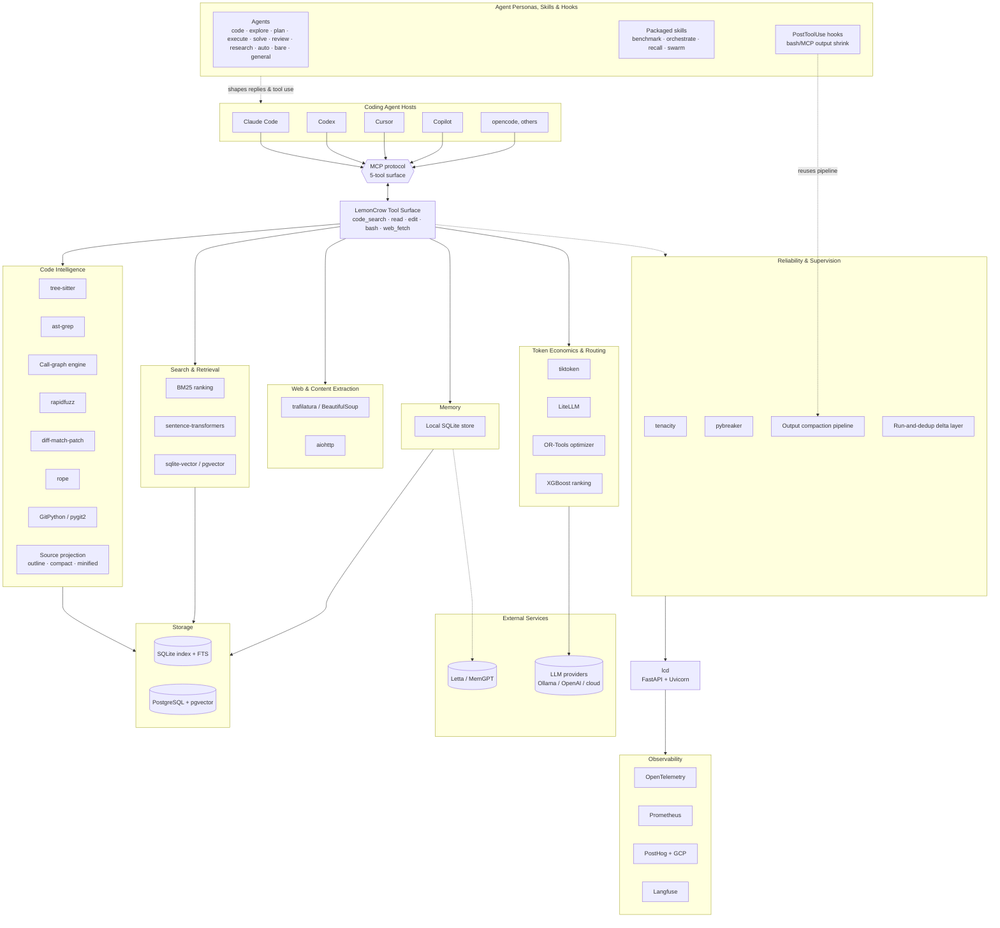

# 🧱 Built With — Technology & Concepts

LemonCrow is a single Python runtime (mypyc-compiled for speed) that your coding agent talks to over **MCP**. Every dependency below earns its place against one rule: **spend fewer tokens to reach a more correct answer.** Here is the full stack and the reasoning behind each choice.

## Architecture at a glance

### Core language & runtime

| Technology                | What it is                                                                                                            | Why LemonCrow uses it                                                                                                                                |
| --------------------------- | ----------------------------------------------------------------------------------------------------------------------- | ---------------------------------------------------------------------------------------------------------------------------------------------------- |
| **Python 3.12–3.13**     | Implementation language                                                                                               | Ubiquitous in the AI/agent ecosystem; rich parsing, ML, and tooling libraries                                                                      |
| **mypyc**                 | Ahead-of-time compiler (typed Python → C extensions)                                                                 | Hot paths (parsing, ranking, indexing) compile to native code on build (`hatch_build.py`); strict typing pays off twice — correctness *and* speed |
| **Pydantic v2**           | Typed models + validation (Rust-backed core)                                                                          | Every tool request/response, config, and on-disk record is a validated model — schema errors fail fast and cheap                                  |
| **Click**                 | CLI framework                                                                                                         | Powers the`lc` command tree (~35 command groups)                                                                                              |
| **Rich + prompt-toolkit** | Terminal rendering + interactive prompts                                                                              | Readable, budget-aware CLI output and the`init`/auth wizards                                                                                       |
| **rtk**                   | CLI proxy that reduces LLM token consumption by 60-90% on common dev commands (single Rust binary, zero dependencies) | Improves token efficiency for agent commands, reducing context usage and cost                                                                      |

### Code intelligence — the grounded layer

| Technology                                      | What it is                                                                            | Why LemonCrow uses it                                                                                                                                   |
| ------------------------------------------------- | --------------------------------------------------------------------------------------- | ------------------------------------------------------------------------------------------------------------------------------------------------------- |
| **tree-sitter** + **tree-sitter-language-pack** | Incremental, error-tolerant parsers for 40+ languages                                 | Builds the symbol table, file outlines, and call graph behind`code_search`/`read`/`explore` — language-agnostic, no per-language LSP server required |
| **ast-grep** | Structural AST-based code search and pattern matching (single Rust binary, zero deps) | Precision layer for post-edit rename verification and security scanning — matches code*structure*, not text; catches eval/exec/subprocess-injection patterns and finds actual code refs during rename, dropping comment/string false positives |
| **Call-graph engine** (in-house)                | Resolves definitions, callers, callees, usages; ranks symbols by call-graph centrality via degree-normalized, macro-aware PageRank | Returns the exact symbol and its neighborhood in one call instead of grep-then-read loops — the core of the token savings; centrality ranking (out-degree-normalized so a promiscuous caller can't outrank a real hub, C macro invocations excluded from callee counts) powers the `graph(kind="centrality")` tool and reranker-training features |
| **Source projection** (in-house)                | Six`read` views — `summary` / `exact` / `range` / `outline` / `compact` / `minified` | Shapes what a read returns per request — outline or minified body instead of the raw file, full text only when the task actually needs it            |
| **rapidfuzz**                                   | Fast fuzzy string matching                                                            | Fuzzy symbol lookup and the edit tool's fuzzy anchor matching                                                                                         |
| **diff-match-patch**                            | Myers diff / patch                                                                    | Deterministic, conflict-tolerant file edits                                                                                                           |
| **rope**                                        | Python refactoring library                                                            | Safe symbol rename (the`rename` extra)                                                                                                                |
| **GitPython** + **pygit2** (libgit2)            | Git plumbing                                                                          | Repo introspection, history archaeology, and worktree/swarm management — pygit2 for the hot paths                                                    |

### Search & retrieval

| Technology                              | What it is                     | Why LemonCrow uses it                                                                                                                                                                                                                                                    |
| ----------------------------------------- | -------------------------------- | ------------------------------------------------------------------------------------------------------------------------------------------------------------------------------------------------------------------------------------------------------------------------ |
| **SQLite (+ FTS)**                      | Embedded, single-file index DB | The local code index, keyword/BM25 search, and the`sql` tool — zero servers, ships with Python                                                                                                                                                                        |
| **BM25** (in-house ranking)             | Lexical relevance scoring      | Exact-match relevance for`grep`/`search` and context reuse                                                                                                                                                                                                             |
| **blake3**                              | Cryptographic hash             | Content-addressed cache keys → incremental re-indexing touches only what changed                                                                                                                                                                                      |
| **sentence-transformers** + **PyTorch** | Embedding inference            | Local semantic code search; ships**BGE-Code-v1**, auto-falls back to **SFR-Embedding-Code-400M** on low VRAM                                                                                                                                                           |
| **sqlite-vector** (TurboQuant)          | In-DB 4-bit-quantized ANN scan | Large-repo semantic top-K runs*inside* SQLite over quantized vectors — linux's 1.24M×1536 store scans from ~960 MB of quantized data instead of loading a 7.5 GB NumPy matrix into Python (no more OOM); the exact NumPy cosine path stays as a transparent fallback |
| **pgvector** + **NumPy**                | Vector similarity / ANN        | Postgres-backed or in-process cosine for small/shared repos; NumPy is also the exact fallback under the sqlite-vector scan                                                                                                                                             |
| **psycopg**                             | PostgreSQL driver              | The`postgres` backend for index + analytics at team scale                                                                                                                                                                                                              |

### Web & content extraction

| Technology                                                                 | What it is                | Why LemonCrow uses it                                                                             |
| ---------------------------------------------------------------------------- | --------------------------- | ------------------------------------------------------------------------------------------------- |
| **trafilatura** + **BeautifulSoup** + **markdownify** + **markdown-it-py** | HTML → clean Markdown    | `web_fetch` strips nav, scripts, and chrome so only readable content reaches the context window |
| **aiohttp** + **urllib3** + **yarl**                                       | Async HTTP + URL handling | Concurrent fetches and provider calls                                                           |
| **regex**                                                                  | Advanced regex engine     | Patterns beyond the stdlib`re` for search and parsing                                           |

### Memory

| Technology                      | What it is                  | Why LemonCrow uses it                                                                    |
| --------------------------------- | ----------------------------- | ---------------------------------------------------------------------------------------- |
| **Local memory store (SQLite)** | Default, server-free recall | Repo/session facts and lessons without any hosted backend                              |
| **Letta (MemGPT)**              | Agent memory server         | Optional durable cross-session memory and archival recall (`letta-client` talks to it) |

### Token economics & model routing

| Technology          | What it is                     | Why LemonCrow uses it                                                          |
| --------------------- | -------------------------------- | ------------------------------------------------------------------------------ |
| **tiktoken**        | BPE tokenizer                  | Exact token counting for budgets, cost tracking, and the live savings badges |
| **LiteLLM**         | Multi-provider LLM gateway     | Cross-vendor model routing (`route`/`router` commands)                       |
| **Ollama**          | Local LLM runtime              | On-device models for "smart" features (summarize/classify) with no API cost  |
| **OpenAI SDK**      | Cloud LLM client               | Optional cloud model calls for routing/cloud features                        |
| **Google OR-Tools** | Constraint/optimization solver | The budget optimizer — allocating token and cost budget across steps        |
| **XGBoost**         | Gradient-boosted trees         | Learned ranking signals (e.g. PR-risk and rank models)                       |

### Service, API & daemon

| Technology                | What it is              | Why LemonCrow uses it                                                |
| --------------------------- | ------------------------- | -------------------------------------------------------------------- |
| **FastAPI** + **Uvicorn** | ASGI framework + server | The`lcd` daemon, local HTTP API, and badge/insights endpoints |

### Reliability & supervision

| Technology                                         | What it is                                                                                                                                                                                                                                                                                                                                                                    | Why LemonCrow uses it                                                                                                                                                                                                                                                                                                                                                                                                 |
| ---------------------------------------------------- | ------------------------------------------------------------------------------------------------------------------------------------------------------------------------------------------------------------------------------------------------------------------------------------------------------------------------------------------------------------------------------- | --------------------------------------------------------------------------------------------------------------------------------------------------------------------------------------------------------------------------------------------------------------------------------------------------------------------------------------------------------------------------------------------------------------------- |
| **tenacity**                                       | Retry with backoff                                                                                                                                                                                                                                                                                                                                                            | Resilient provider and network calls                                                                                                                                                                                                                                                                                                                                                                                |
| **pybreaker**                                      | Circuit breaker                                                                                                                                                                                                                                                                                                                                                               | Tool supervision trips a breaker on repeated failures instead of looping                                                                                                                                                                                                                                                                                                                                            |
| **cryptography**                                   | Signing / verification                                                                                                                                                                                                                                                                                                                                                        | Signed license leases verified**offline** against a baked-in public key                                                                                                                                                                                                                                                                                                                                             |
| **Bash/MCP output compaction pipeline** (in-house) | Tiered post-hoc shrink — ANSI strip → dedup-with-count → test-failure extraction → suppress-on-success for noisy mutators (git/package-manager/docker commands) → anomaly windows → head/tail char budgets                                                                                                                                                              | Every bash and MCP tool result is compacted before it reaches context, without losing the line an agent actually needs; the same pipeline is reused verbatim by the host-Bash and shadow-MCP hooks below                                                                                                                                                                                                            |
| **Post-edit contract verification** (in-house)     | After every rename/edit, checks untouched files for remaining references to the changed literal, symbol, or signature via ast-grep (precision) + rg text search (recall)                                                                                                                                                                                                 | Surfaces parallel sites the agent may have missed as FIXME evidence — the `contract` MCP tool; structural matching drops comment/string noise that text-only search would surface                                                                                                                                                                                                                                     |
| **Security SAST scanner** (in-house)               | Bundled OWASP/CWE ast-grep rule pack (eval/exec, subprocess shell injection, SQL concatenation, hardcoded secrets) plus bounded Python taint analysis (intra-procedural sources→sinks)                                                                                                                                                                                    | First-iteration SAST for agent-generated code — fail-open, every finding carries rule_id/severity/confidence; exposed as the `scan` MCP tool; without ast-grep the rule pack is skipped, taint-only runs                                                                                                                                                                                                             |
| **Run-and-dedup delta layer** (in-house)           | Session-local SHA-256 digest of`(stdout, stderr, exit_code)` keyed by `(cwd, command)`                                                                                                                                                                                                                                                                                        | A byte-identical re-run (e.g.`git status` polled in a loop) collapses to a one-line "unchanged" marker; execution is never skipped, so external-state commands (`docker ps`, timestamped output) stay correct by construction — there's no cache to invalidate                                                                                                                                                     |
| **MCP proxy lane** (in-house)                      | One`mcp(server, tool, params)` tool + an on-demand catalog; configured stdio MCP servers are discovered from host configs and spawned lazily on first use                                                                                                                                                                                                                     | Foreign MCP tools run*behind* the gateway and inherit the same output bounding as LemonCrow's own tools — one schema instead of N servers × M tool schemas — kept off the advertised surface by design (an escape-hatch surface, callable by name); the supported path for third-party MCP savings is the shadow hook, which changes no routing and leaves MCP lifecycle, permissions, and status UX with the host |
| **Spill store + one notice grammar** (in-house)    | Oversized output lands in a recoverable file; every shrink/spill/truncate/compact event — across bash, MCP results, web_fetch, sql, and the host-lane hooks — emits the same single footer:`[lc: {verb} {orig}→{kept} chars; full: read {path} (:L1-L200 to page)]`                                                                                                   | The model learns exactly one pattern for "output was reduced, here's how to recover the rest" instead of per-tool notice dialects; recovery is always the same`read` call                                                                                                                                                                                                                                           |
| **Type-aware summary ladder** (in-house)           | `read <path>:summary` / `web_fetch(summary=true)`: extractive gist picked by content type — heading tree for docs, shape+samples for JSON, header+rows for CSV, traceback surfacing for logs, outline-if-it-fits or symbol inventory for code, LexRank sentence centrality for prose — upgraded to a local LLM (Ollama / OpenAI-compatible) when reachable, never dependent on it | The cheap "should I spend tokens here?" read is one bounded call (≤4 KiB) on any content, including spill files; footer verb records the tier (`summarized:heuristic` / `summarized:{model}` / `summarized:outline`)                                                                                                                                                                                               |

### Observability & telemetry

| Technology                           | What it is                      | Why LemonCrow uses it                                                                |
| -------------------------------------- | --------------------------------- | ------------------------------------------------------------------------------------ |
| **OpenTelemetry** (API / SDK / OTLP) | Vendor-neutral traces + metrics | Every session emits spans/metrics; local-first with a strict allowlist and opt-out |
| **Prometheus client**                | Metrics exposition              | Runtime metrics endpoint                                                           |
| **PostHog + GCP** (sinks)            | Product analytics / warehouse   | The opt-out telemetry pipeline (OTLP → PostHog + GCP)                             |
| **Langfuse**                         | LLM-level tracing               | Optional trace-level LLM observability                                             |

### Packaging & distribution

| Technology                           | What it is                  | Why LemonCrow uses it                                                                                                    |
| -------------------------------------- | ----------------------------- | ------------------------------------------------------------------------------------------------------------------------ |
| **MCP SDK** (Model Context Protocol) | Agent ⇄ tool wire protocol | How every host (Claude Code, Codex, Cursor, Copilot, opencode, …) talks to LemonCrow                                    |
| **hatchling**                        | Build backend               | Wheel builds + force-includes (integrations, lexicons) and the mypyc build hook                                        |
| **PyInstaller**                      | Portable binary builds      | The release distribution (`lemoncrow-distribution-*.tar.gz`)                                                             |
| **uv**                               | Dependency / venv manager   | Reproducible installs; the installer runs`uv tool install`                                                             |
| **vendored `babel` stub**            | Minimal functional shim     | `courlan` only needs `Locale.parse(...).language` — LemonCrow vendors a ~30-line stub instead of the 32 MB real package |

### Monetization backend (proprietary)

| Technology             | What it is              | Why LemonCrow uses it                                                     |
| ------------------------ | ------------------------- | ------------------------------------------------------------------------- |
| **Cloudflare Workers** | Edge serverless runtime | The Stripe→plan bridge and the landing auth API — global, low-latency |
| **Cloudflare D1**      | Edge SQLite database    | Plan rows and OAuth account/session records                             |
| **Stripe**             | Payments                | Checkout → plan on the account → OAuth entitlement                    |

### Quality gate (developer tooling)

| Technology                         | What it is          | Why LemonCrow uses it                          |
| ------------------------------------ | --------------------- | ---------------------------------------------- |
| **pytest** (+ xdist, cov, timeout) | Test runner         | The suite, parallelized                      |
| **ruff** + **black**               | Lint + format       | Style and lint gate                          |
| **mypy --strict**                  | Static type checker | Strict typing across`src` (also feeds mypyc) |
| **vulture**                        | Dead-code detection | Keeps the surface lean                       |

### Concepts that tighten the loop

- **MCP-native, 5-tool surface** — fewer advertised tools means fewer decisions per turn, so the agent leads with the right primitive.
- **Telegraphic instruction surface** — every LLM-facing string (tool/param descriptions, agent personas, skill bodies) is written telegraphically: articles, copulas, and filler dropped; content words, defaults, and behavior contracts kept. Roughly 30–45% fewer instruction tokens on every turn with zero contract loss (examples in the [section below](#telegraphic-instruction-surface)).
- **Grounded retrieval over blind reading** — a call graph + symbol index replace grep-and-read navigation.
- **Token budgeting everywhere** — every tool caps and structures output, spilling to disk instead of dumping into context.
- **Host-lane parity for output shrinking** — PostToolUse hooks apply that same compaction pipeline to the host's builtin Bash tool (≥2K chars with ≥500 saved) and to oversized results from any other (non-LemonCrow) MCP server (32 KiB default, `LEMONCROW_SHADOW_SHRINK_CHARS`), so the savings aren't confined to LemonCrow's own MCP lane. Fail-open by construction: any hook error leaves the original result untouched.
- **One proxy for foreign MCPs** — `mcp(server=…, tool=…, params=…)` runs any configured stdio MCP server behind the gateway with lazy spawn and an on-demand catalog, replacing N×M tool schemas with one and giving every third-party result the same spill/compact bounding; deliberately hidden — the host keeps MCP lifecycle, updates, permissions, and status UX, and the shadow hooks cover the token side with no routing change.
- **One notice grammar** — every reduced output, whatever tool produced it, ends with the same footer (`[lc: {verb} {orig}→{kept} chars; full: read {path} (:L1-L200 to page)]`), so recovering full output is one learned pattern, not per-tool folklore.
- **Budget-first read projections** — `read` takes `:summary` (type-aware extractive gist — headings for docs, shape for JSON, tracebacks for logs, outline-if-it-fits for code — upgraded by a local LLM when one is reachable, never dependent on it) and `:outline` (forced structural projection); `web_fetch(summary=true)` applies the same ladder to fetched pages. Conflicting projections never error: the most detailed request wins (expand > range > outline > summary), because an agent can gist down for free but recovering detail costs a turn.
- **Self-auditing token spend** — `lc audit bash` ranks command families by tokens still shipped vs. saved after compaction, turning missed savings into a concrete backlog instead of a guess.
- **Hybrid lexical + semantic search** — BM25 for exact matches, embeddings for intent.
- **Content-addressed incremental indexing** — blake3 hashing re-indexes only what changed.
- **Edit-verify gate** — edits run lint/type/test checks before they are accepted.
- **Circuit-broken tool supervision** — repeated failures trip a breaker instead of looping.
- **Host-agnostic packaging** — one runtime, generated MCP configs and personas for every supported agent CLI.
- **Offline-first licensing** — signed leases are verified locally; the network is only touched for enrollment and refresh.
- **mypyc-compiled hot paths** — native speed for parsing, ranking, and indexing.

### Telegraphic instruction surface

Every LLM-facing string LemonCrow ships — tool and parameter descriptions, agent personas, skill bodies — is written in **telegraphic style**: drop articles, copulas, and connective filler; keep content words, defaults, and every behavior contract. The personas instruct the model to answer the same way. Same meaning, fewer tokens — in both directions, on every turn.

**1. What the model reads** — the `web_fetch` tool's `query` parameter description, before and after:

> **Normal prose — 398 chars ≈ 87 tokens**
>
> "Optional search term. When the page is too long to return in full, instead of a blind head cut, the most relevant sections/table-rows to this term are kept (ranked by embedding similarity if a local embedder is configured, else by keyword coverage) — use this to jump straight to a specific row/section in a long table or doc instead of paging through it. Omit to keep the default head truncation."

> **Telegraphic — 269 chars ≈ 60 tokens (31% fewer)**
>
> "Optional search term. Long page → keep the sections/table-rows most relevant to the term (embedding rank when a local embedder is configured, else keyword coverage), not a blind head cut — jump straight to one row/section of a long table or doc. Omit = head truncation."

Tool schemas ship on **every request**, so this saving repeats every turn of every session.

**2. What the model writes** — the same question answered without and with the terse persona instruction:

_Prompt:_ "Why is the retry test flaky?"

> **Default output — 350 chars ≈ 71 tokens**
>
> "I looked into the failing test and it seems like the flakiness is caused by the retry logic using a real clock. The test sleeps for 100ms and then asserts that exactly three retries happened, but under CI load the timing can drift, which makes the assertion fail intermittently. I'd recommend injecting a fake clock so the test becomes deterministic."
>
> **Telegraphic output — 153 chars ≈ 38 tokens (46% fewer)**
>
> "Root cause: retry test uses a real clock — 100ms sleep + exact 3-retry assert drifts under CI load. Fix: inject a fake clock; test becomes deterministic."

Every default, number, and behavior clause survives — only the filler is gone. Output tokens are the expensive ones, and they also feed back into context on the next turn.

**Accounting note.** The savings ledger records per-tool-call counterfactuals (what vanilla Claude Code would have inlined versus what LemonCrow actually returned), recomputed from current content at dispatch time. The two sides of the telegraphic surface are treated differently:

- **What the model writes** — credited. The Stop hook writes a `kind: "output_style"` row per session: measured *prose* output tokens (text + thinking blocks, code fences excluded — telegraphic style compresses prose, not code) × (`LEMONCROW_OUTPUT_STYLE_RATIO` − 1), priced at the output rate plus one cache write. The default ratio (1.2) is deliberately conservative against the ~1.8× measured on pure Q&A prose. It surfaces as the `↓O` segment on the statusline and the `O` item on the stop summary.
- **What the model reads** — not credited. The instruction surface itself (tool schemas, server instructions, personas, skill bodies) never appears in any ledger row, and no baseline remembers the pre-compression sizes; the compression is a permanent reduction in actual spend. The before/after counts in this section and the README record the one-time step change, and `tests/gateway/test_telegraphic_budget.py` caps per-schema, schema-total, server-instruction, and persona token budgets so the surface cannot silently grow back.
